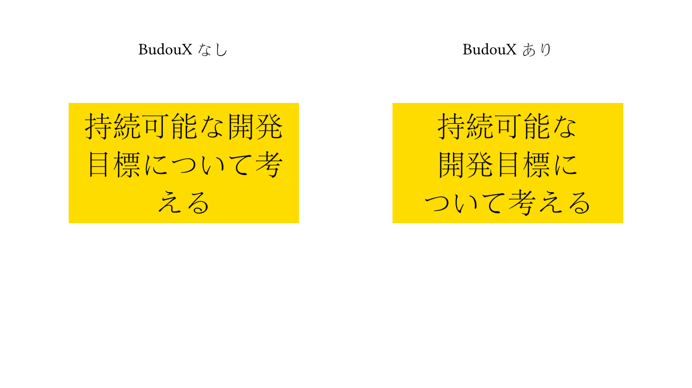

# typst-budoux

[BudouX](https://github.com/google/budoux) による日本語の改行位置調整を、Typstの[Wasmプラグイン](https://typst.app/docs/reference/foundations/plugin/)として提供します。

文中の意味的なまとまり（チャンク）の境界以外では改行が起きないように、チャンク内の文字間にWORD JOINER (U+2060)、チャンクの境界にZERO WIDTH SPACE (U+200B)を挿入します。

## 利用方法

### インストール

```sh
rustup target add wasm32-unknown-unknown
cargo build --release --target wasm32-unknown-unknown

PKG_DIR="$(typst info | awk -F': ' '/Package path/{print $2}')/local/budoux/0.1.0"
mkdir -p "$PKG_DIR"
cp typst.toml lib.typ "$PKG_DIR"
cp target/wasm32-unknown-unknown/release/typst_budoux.wasm "$PKG_DIR/typst-budoux.wasm"
```

### 使い方

```typst
#import "@local/budoux:0.1.0": segment

#set text(lang: "ja")
#segment("これは日本語の文章をBudouXで分割するテストです。")
```

`test.typ` に動作確認用の例があります。

```sh
typst compile test.typ test.png
```

スライドのタイトルを想定した例です。BudouXによって意味的なまとまりの境界で改行されていることがわかります。



## ライセンス

[Apache License 2.0](LICENSE-APACHE) または [MIT License](LICENSE-MIT) のデュアルライセンス（依存する[BudouX](https://github.com/google/budoux)がApache-2.0のため）。
